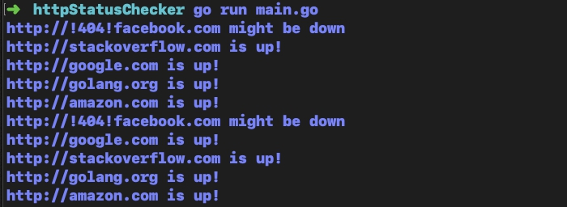

# HTTP status checker

Check the current status of website.
Able to detect if website is downed due to http request returns 404.



### Step 1. 
Clone this project.


### Step 2.
open main.go and add URL for status checking website in `links` slice.

```
func main() {
	// add URL for checking website in bellow.
	links := []string{
		"http://google.com",
		"http://!404!facebook.com",
		"http://stackoverflow.com",
		"http://golang.org",
		"http://amazon.com",
	}
```
### Step 2. 

```
$ cd httpStatusChecker

$ run main.go
```

### Require
Install Golang to run this program.